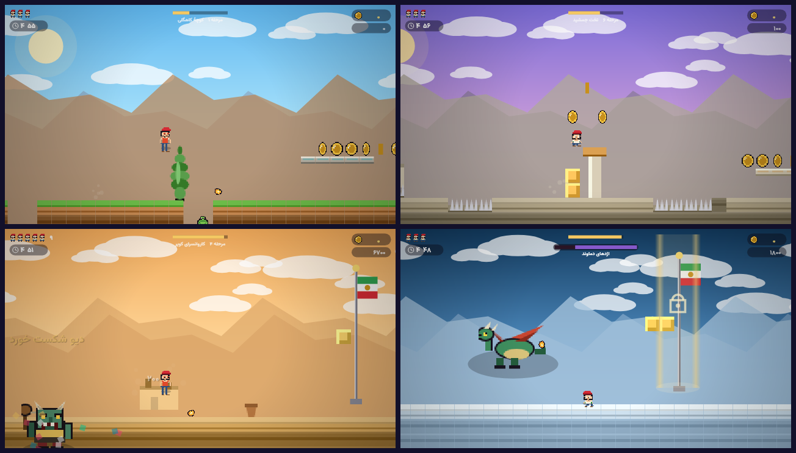

# 🍄 قارچ‌خور — ماجراهای کوکو در ایران

بازی پلتفرمر ایرانی، ساخته‌شده برای موبایل و وب.



> 📱 **دانلود APK:** در صفحهٔ [Releases](../../releases) فایل `gharchekhor-game-v1.0.2.apk` را دانلود کن
> (یا از Actions → artifact). روی اندروید نصب کن و بازی کن — کاملاً آفلاین. کوکو از کوچه‌های کاهگلی تهران تا قلهٔ دماوند می‌دود،
قارچ و سکه جمع می‌کند، با دیو کویر و اژدهای دماوند می‌جنگد و پرچم ایران را بالا می‌برد.

* **۸ مرحله** با هویت ایرانی: کوچهٔ کاهگلی، بازار بزرگ، گلستان ارم، کاروانسرای کویر، قنات زیرزمینی، تخت جمشید، بام‌های تهران، قلهٔ دماوند
* **۲ رئیس:** دیو کویر (مرحلهٔ ۴) و اژدهای دماوند (مرحلهٔ ۸) — هر دو با الگوی حملهٔ خوانا و پنجرهٔ آسیب‌پذیری
* **۳ شخصیت** قابل انتخاب: کوکو، نیلوفر، نوروز
* قدرت‌ها: قارچ بزرگ‌کننده، گل آتش، ستاره، پَر سیمرغ (پرش دوم)
* فروشگاه، دستاوردها، حالت **دوی بی‌پایان**، ایستگاه ذخیره (پرچم میانی)، بانک سکه
* **کنترل لمسی** برای موبایل + پشتیبانی کیبورد
* موسیقی و افکت‌ها **کاملاً سنتز‌شده** با WebAudio در دستگاه‌های شور، ماهور و همایون — هیچ فایل صوتی‌ای در بازی نیست
* **آفلاین:** بازی پس از نخستین بارگذاری با Service Worker بدون اینترنت اجرا می‌شود
* همهٔ گرافیک به‌صورت پیکسل‌آرت روی canvas ساخته می‌شود (تنها فایل دودویی، فونت وزیرمتن است)

## اجرا

```bash
cd game
node tools/serve.mjs 8080     # سپس http://localhost:8080
```

هیچ وابستگی‌ای برای اجرای بازی لازم نیست؛ فقط یک سرور استاتیک برای پوشهٔ `www/`.
برای نصب وابستگی‌های ابزار تست: `cd tools && npm install`.

## کنترل‌ها

| موبایل | کیبورد | کار |
| --- | --- | --- |
| ◀ ▶ | کلیدهای جهت / A D | حرکت |
| ▲ | Space / Z / J | پرش (نگه‌داشتن = پرش بلندتر) |
| 🏃 | Shift / X | دویدن |
| 🔥 | L / C | شوت گل آتش |
| ⏸ | P / Esc | توقف |

## آزمون‌های خودکار

```bash
cd game
npm test                        # همهٔ آزمون‌های زیر، یکی‌یکی

node tools/audio-test.mjs       # موتور صدا: همهٔ افکت‌ها، دستگاه‌ها، کلید موسیقی، پرش زمانی
node tools/validate.mjs         # آیا همهٔ ۸ مرحله با ربات قابل عبورند (با رئیس‌ها)؟
NOFEATHER=1 node tools/validate.mjs
node tools/boss-test.mjs        # آیا هر دو رئیس شکست‌پذیرند؟
node tools/smoke.mjs            # آزمون دود: بوت، منو، کارنامه، دکمه‌های لمسی، دکمهٔ بازگشت اندروید
node tools/sim.mjs 3 12 shot    # شبیه‌سازی و اسکرین‌شات در .arena/tmp
node tools/gallery.mjs          # ساخت docs/gallery.png
python3 tools/apk_check.py path/to/app-debug.apk   # بازرسی محتوای APK
cd tools && node spritesheet.mjs  # جدول همهٔ اسپرایت‌ها
```

آزمون‌های صدا و دود از یک **WebAudio ساختگی سخت‌گیر** استفاده می‌کنند: هر پارامتر NaN/منفی
همان‌جا خطا می‌دهد، پس مسیر صوتی بازی (افکت‌ها و موسیقی دستگاه‌های ایرانی) واقعاً اجرا و بررسی می‌شود.

آزمون‌ها بازی را در یک DOM ساختگی با `@napi-rs/canvas` اجرا می‌کنند؛ نه مرورگر لازم است و نه فایل فونت اضافه.

## ساخت APK اندروید

### با GitHub Actions (پیشنهادی)
ورک‌فلو `.github/workflows/android-apk.yml` با هر تغییر در پوشهٔ `game/` بازی را تست می‌کند،
پلتفرم اندروید را می‌سازد و APK را به‌عنوان artifact بارگذاری می‌کند.
برای ساخت نسخهٔ release و انتشار در Releases، ورک‌فلو را با `release=true` اجرا کن یا یک تگ بزن.

### روی سیستم خودت
```bash
cd game
npm install
npm run android:add      # افزودن پلتفرم + تنظیم چرخش افقی، تمام‌صفحه و آیکون‌ها
npm run android:build    # خروجی: android/app/build/outputs/apk/debug/app-debug.apk
```

## ساختار

```
game/
├── www/                 # خود بازی (بدون build step)
│   ├── index.html       # پوستهٔ RTL + صفحه‌های منو/فروشگاه/تنظیمات
│   ├── css/style.css
│   ├── js/              # config, levels, sprites, entities, game, render, ui, main …
│   ├── assets/fonts/    # وزیرمتن (woff2)
│   ├── assets/img/      # آیکون و اسپلش
│   ├── manifest.webmanifest
│   └── sw.js            # اجرای آفلاین
├── tools/               # ابزارهای توسعه و آزمون (Node)
├── capacitor.config.json
└── package.json
```

## رفتار روی اندروید

* **دکمهٔ بازگشت گوشی** بازی را متوقف می‌کند (در منو، اپ را می‌بندد) — با `@capacitor/app`.
* با رفتن اپ به **پس‌زمینه** بازی خودکار متوقف و موسیقی قطع می‌شود و با بازگشت ادامه پیدا می‌کند.
* چرخش افقی، تمام‌صفحه، آیکون‌های لانچر و اسپلش با `node tools/patch-android.mjs` روی پلتفرم اندروید اعمال می‌شود.

## نکته‌های پیاده‌سازی

* صفحهٔ منطقی ۴۸۰×۲۷۰ با `TILE=16`؛ فیزیک با گام ثابت ۱/۶۰ ثانیه
* مرحله‌ها با مولد بذر‌دار (`makeRng`) ساخته می‌شوند و پس از تولید از چند فیلتر عبور می‌کنند
  تا همیشه عبورپذیر باشند: سقف گودال، فضای سر، سقف شیب، پاک‌سازی گودال، ادغام جزیره‌ها،
  سقف عرض گودال و پاک‌سازی میدان رئیس
* ذخیرهٔ پیشرفت در `localStorage` با کلید `gharchekhor.save.v1`
